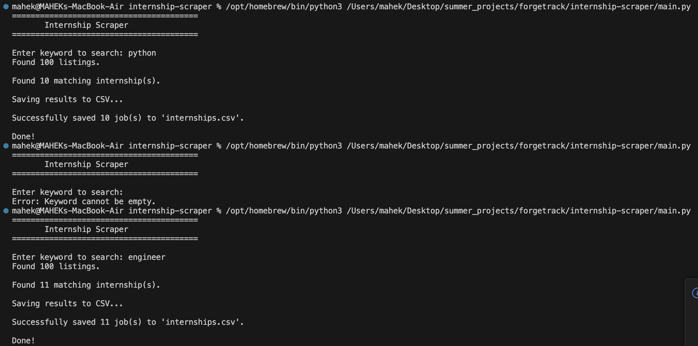

# Internship Scraper

(Option - A)
A command-line automation tool built with Python that scrapes a public job listing webpage, filters results based on a user-provided keyword, and exports the matching internships/jobs to a CSV file.

---

## Features

- Search internships/jobs using a keyword
- Extract:
  - Job Title
  - Company
  - Location
  - Date Posted
  - Application Link
- Export matching results to a CSV file
- Handles missing webpage fields gracefully
- Checks `robots.txt` before scraping
- Uses a custom User-Agent
- Adds a polite 1-second delay between requests
- Handles common errors without crashing

---

## Technologies Used

- Python 3
- Requests
- BeautifulSoup4
- CSV
- urllib.robotparser

---

## Project Structure

```text
internship-scraper/
│
├── main.py
├── scraper.py
├── csv_utils.py
├── utils.py
├── requirements.txt
├── README.md
├── .gitignore
├── internships.csv
└── screenshots/
```

---

## Installation

Clone the repository.

```bash
git clone https://github.com/mahek888/internship-scraper.git
```

Move into the project folder.

```bash
cd internship-scraper
```

Install the required libraries.

```bash
pip install -r requirements.txt
```

---

## Running the Program

```bash
python main.py
```

---

## Command-Line Argument

When prompted, enter a keyword to search for internships/jobs.

Example:

```
Enter keyword to search: python
```

The program searches all available listings and exports only the matching results.

---

## CSV Output

The generated `internships.csv` contains:

| Column | Description |
|--------|-------------|
| Title | Internship/Job Title |
| Company | Company Name |
| Location | Job Location |
| Date | Date Posted |
| Link | Application URL |

The CSV file can be opened using Microsoft Excel, Google Sheets, or any spreadsheet software.

---

## Error Handling

The application gracefully handles:

- Empty keyword input
- No matching internships found
- Missing webpage fields
- Internet connection failures
- HTTP request errors
- Request timeouts
- CSV write errors

---

## Responsible Web Scraping

This project follows responsible scraping practices by:

- Checking `robots.txt` before scraping
- Using a custom User-Agent
- Waiting one second between requests
- Scraping only publicly accessible pages

---

## Screenshots



---

## Notes

This project uses the **Real Python Fake Jobs** practice website, which is designed for learning web scraping. The implementation can be adapted to scrape other publicly accessible job listing websites that permit automated access.